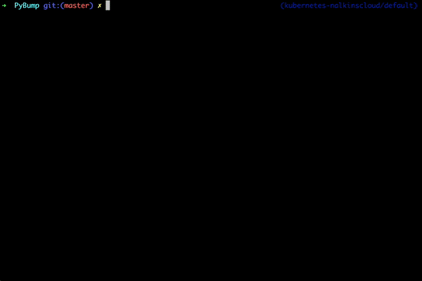

=====================
Python Version Bumper
=====================
.. image:: https://github.com/arielevs/pybump/workflows/Python%20package/badge.svg
    :alt: Build
    :target: https://pypi.org/project/pybump/

.. image:: https://codecov.io/gh/ArieLevs/PyBump/branch/master/graph/badge.svg?token=P3AZKGX5IR
    :alt: Code Coverage
    :target: https://codecov.io/gh/ArieLevs/PyBump

.. image:: https://img.shields.io/pypi/v/pybump.svg
    :alt: Version
    :target: https://pypi.org/project/pybump/

.. image:: https://img.shields.io/pypi/l/pybump.svg?colorB=blue
    :alt: License
    :target: https://pypi.org/project/pybump/

.. image:: https://img.shields.io/pypi/pyversions/pybump.svg
    :alt: Python Version
    :target: https://pypi.org/project/pybump/

A simple Python script for updating the version in Kubernetes Helm ``Chart.yaml``,
``VERSION``, and ``pyproject.toml/setup.py`` files.

- Ensures version consistency across all files.
- Enforces `Semantic Versioning 2.0.0 <https://github.com/semver/semver/blob/master/semver.md>`_.
- Supports an optional lowercase 'v' prefix (e.g., ``v1.5.4-beta2``).

Installation
============
To install pybump, run:

.. code-block:: bash

    pip install pybump

Usage
=====

Bumping Versions
----------------

To **bump** the version:

.. code-block:: bash

    pybump bump [-h] --file PATH_TO_CHART.YAML --level {major,minor,patch} [--quiet]

Setting Explicit Versions
-------------------------

To **set** an explicit version or automatically update release metadata:

.. code-block:: bash

    pybump set --file PATH_TO_CHART.YAML --set-version X.Y.Z [--quiet]

The **auto** flag is primarily intended for CI/CD pipelines, such as pull request workflows:

.. code-block:: bash

    pybump set --file PATH_TO_CHART.YAML --auto [--quiet]

When using `--auto`, `pybump` appends the Git commit hash as release metadata to the version.

 * Warning - The `--auto` flag can be risky, as it may detect a Git repository unintentionally.
   Ensure that the target file is part of the correct repository before running this command.

Retrieving the Current Version
------------------------------

To **get** the current version:

.. code-block:: bash

    pybump get --file PATH_TO_CHART.YAML

Updating Helm Chart `appVersion`
--------------------------------

To bump, get, or set the `appVersion` field in a Helm chart, use the ``--app-version`` flag:

.. code-block:: bash

    pybump bump [-h] --file PATH_TO_CHART.YAML --level {major,minor,patch} [--quiet] [--app-version]

.. note::

    The ``--app-version`` flag applies only to Helm `Chart.yaml` files and has no effect on other file types.

Examples
========

CI Usage example
----------------

A simple Jenkins CI pipeline (using the Kubernetes plugin) that utilizes the
``set --file setup.py --auto`` option:

..  code-block:: java

    String label = "test-bump-ci-runner"
    podTemplate(
            label: label,
            containers: [
                    containerTemplate(
                            name: 'pybump',
                            image: "arielev/pybump:1.10.2",
                            ttyEnabled: true,
                            command: 'sleep',
                            args: '1d'
                    ),
                    containerTemplate(
                            name: 'jnlp',
                            image: 'jenkins/inbound-agent:jdk11',
                            ttyEnabled: true
                    )
            ]
    ) {
        node(label) {
            timeout(time: 10, unit: 'MINUTES') {
                ansiColor('xterm') {
                    String version = ""
                    container('jnlp') {
                        git credentialsId: "credentials_id_here", url: "https://github.com/arielevs/pybump"
                    }
                    container('pybump') {
                        version = sh(
                                script: "pybump set --file setup.py --auto",
                                returnStdout: true
                        ).trim()
                    }
                    println(version)
                }
            }
        }
    }

Version Bumping Examples
------------------------

Case: ``version: 0.0.1``

.. code-block:: bash

    pybump bump --file Chart.yaml --level patch

**Result:** Version updated to ``0.0.2``.

---

Case: ``version: 0.1.4-alpha+meta.data``

.. code-block:: bash

    pybump bump --file Chart.yaml --level minor

**Result:** Version updated to ``0.2.0-alpha+meta.data``.

---

Case: ``version: v0.0.3``

.. code-block:: bash

    pybump bump --file Chart.yaml --level major

**Result:** Version updated to ``v1.0.0``.

---

Case: ``version: 0.0.1+some-metadata``

.. code-block:: bash

    pybump set --file Chart.yaml --set-version 1.4.0

**Result:** Version updated to ``1.4.0+metadata-here``.

---

Case: ``version: v7.0.2``

.. code-block:: bash

    pybump set --file setup.py --auto

**Result:** Version updated to ``v7.0.2-5a51e0e1d9894d3c5d4201619f10be242320cb59``.

---

Case: ``appVersion: 2.3.2``

.. code-block:: bash

    pybump bump --file Chart.yaml --level patch --app-version

**Result:** ``appVersion`` updated to ``2.3.3``.

---

Case: ``version: 1.0.13``

.. code-block:: bash

    pybump get --file Chart.yaml

**Result:** Returns ``1.0.13``.

---

Case: ``version: 1.0.13+some-metadata``

.. code-block:: bash

    pybump get --file Chart.yaml --release

**Result:** Returns ``some``.

Using a Container Image
-----------------------

To run `pybump` within a container:

.. code-block:: bash

    docker run --rm --volume $(pwd):/tmp -t arielev/pybump set --file /tmp/setup.py --auto